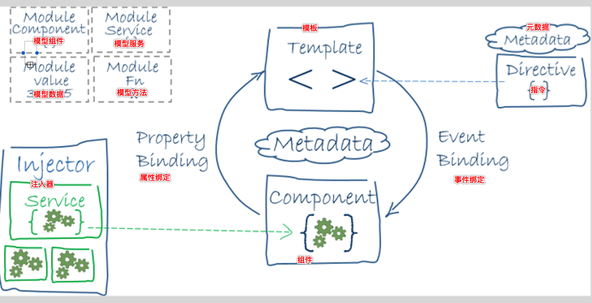
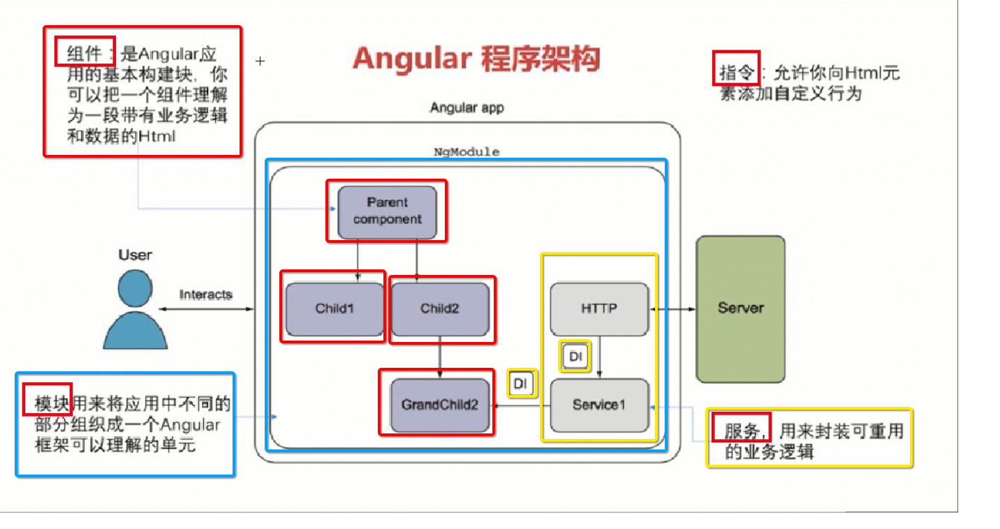
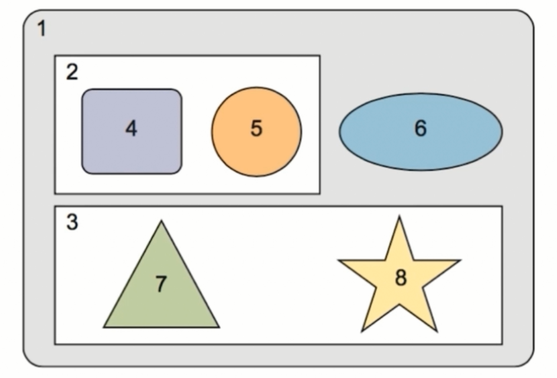

## Angular

主讲：陈华旺

### 一、Angular 简介

用于解决、实现 SPA （ 单页应用程序 ）项目

简化DOM的操作，动态DOM 对象的监视和更新

使用 **模块化** 开发的思想

>Angular is a framework for building client applications in HTML and either JavaScript or a language like TypeScript that compiles to JavaScript.

Angular 是一个用 HTML 和 JavaScript 或者一个像TypeScript一样可以被编译成JavaScript的语言，来构建客户端应用的框架。

### 二、版本

Angular  4，5  两个版本

AngularJS 包含 1.x   2.x

分水岭   I  AngularJS  和 II   Angular  

```
https://github.com/angular/angular/blob/2.3.x/modules/%40angular/router/CHANGELOG.md
```

因为AngularJS   和 内置路由 版本不对齐，所有直接跳过了版本3

### 三、Angular 程序构成



+ 模块  Module
+ 组件 Component
+ 模板 Template
+ 元数据  MetaData
+ 数据绑定 Data Binding
+ 指令  Directive
+ 服务  Service
+ DI  依赖注入    Dependency Injector

```
用户 ===>  Root Module (应用程序的首页 、 用户入口)
Angular 应用程序  ==>  模块 + 模块 + ……
模块  ===>  组件  + 子模块 + 服务 
组件  ===>   组件三要素  +  可选要素
组件的三要素  ===>   模板   +  装饰器   +   控制器
可选要素   ===>   输入属性  +  输出属性  +  提供器  +  生命周期函数   +   样式表   + 动画   + ……
模板    ===>   html  +  css    +   AngularML(Angular组件标签名)
```



### 四、开发环境搭建

#### 1、安装NodeJS

#### 2、安装Angular/CLI

+  Command line  interface 命令行接口（提供一些终端命令 ，用于实现终端代码）

```powershell
[sudo]  npm install -g @angular/cli
# TypeScript 语法模块
ng -v  #查看版本
```

### 五、HelloWorld

#### 1、创建一个项目

```powershell
#切换项目存储目录

# ng new 项目名称  [参数]

ng new itanyAngular --routing  # 添加路由
# 创建完成项目结构后 ， 会自动调用 npm install
# 200M   ==>  ctrl + c

# 切换到项目目录下
[sudo] npm install

#You can `ng set --global packageManager=cnpm`.
#Installing packages for tooling via npm.

# 启动angular 项目
ng server

# 浏览器中 访问  127.0.0.1:4200
```

#### 2、目录结构

**建议不要修改cli生成的文件或文件夹得名称，除非你知道在干什么**

```
项目
	|---e2e    端到端测试目录
	|---node_modules   第三方依赖包
	|---src    应用程序源码目录  (开发者 开发的代码)
		|---app      应用程序中所有的组件和模块存储目录 (i)
		|---assets   静态资源文件夹  图片
		|---environments   支持多环境开发配置目录(开发环境、生产环节、测试环境)
		-favicon.ico       浏览器图标
		-index.html        浏览器加载的首页文件  (i)
		-main.ts           整个主入口，angular 会从该文件进行程序加载  (i)
		-polyfills.ts      完成老版本浏览器兼容问题
		-styles.css        项目全局样式表  (i)
		-test.ts             测试文件
		-tsconfig.app.json   编译器配置文件
		-tsconfig.spec.json  ts 的测试文件
		-typings.d.ts
	-.angular-cli.json    cli的配置文件   (i)
	-.editorconfig        vscode 编辑器的配置文件
	-.gitignore			  git 的忽略文件
	-.karma.conf.js       单元测试配置文件
	-package.json         项目描述和依赖管理文件
	-protractor.conf.js   自动化测试配置工具
	-README.md       
	-tsconfig.json        定义TypeScript的配置文件
	-tslint.json		  进行 TS 文件的代码质量监测配置文件
```

#### 3、项目启动

```powershell
ng server 

# 在项目的目录下进行运行
```

#### 4、项目的启动

```
@angular/cli  启动全局的  webpack-dev-server
=====>加载项目中  .angular-cli.json 
=====>加载 index.html
=====>加载  main.ts 文件(ts编译=>js)
	----->bootstrapModule()  引导模块加载  NgModule
		-----> 通过bootstrap 属性  完成主组件的引导
			----> 模板  css 样式加载
			    ----> 指定选择器，主体展示区
			   	通过标签选择器  定位index.html 中的展示区的第一个  匹配标签  使用 append 

```

### 六、再探HelloWorld

#### 1、.angular-cli.json 

```json
{
  "$schema": "./node_modules/@angular/cli/lib/config/schema.json",
  //  定义项目描述信息
  "project": {
    // 项目名称
    "name": "itanyangular"
  },
  // 整个应用程序的配置属性
  "apps": [
    {
      // 根目录
      "root": "src",
      // 输出目录  ==>  项目发布时的打包输出目录
      "outDir": "dist",
      // 项目的静态资源名称或静态资源目录
      "assets": [
        // 静态资源文件和静态资源目录 均 相对于 root 属性而言
        "assets",
        "favicon.ico"
      ],
      // 项目首页   相对于 root 属性而言
      "index": "index.html",
	  // 程序主体入口   相对于 root 属性而言
      "main": "main.ts",
      "polyfills": "polyfills.ts",
      "test": "test.ts",
      "tsconfig": "tsconfig.app.json",
      "testTsconfig": "tsconfig.spec.json",
      // 资源前缀 (在创建组件或者其它文件时存在相关作用)  ?
      // 为组件添加名称前缀
      "prefix": "app",
      // 定义项目全局样式文件  文件名  相对于 root 属性而言
      // 加载三方 样式库  bootstrap  ?
      "styles": [
        "styles.css"
      ],
      // 全局js文件  文件名 相对于 root 属性而言
      //  ****  加载三方js 插件   jquery  bootstrap.js   ?
      "scripts": [],
      "environmentSource": "environments/environment.ts",
      "environments": {
        "dev": "environments/environment.ts",
        "prod": "environments/environment.prod.ts"
      }
    }
  ],
  "e2e": {
    "protractor": {
      "config": "./protractor.conf.js"
    }
  },
  "lint": [
    {
      "project": "src/tsconfig.app.json",
      "exclude": "**/node_modules/**"
    },
    {
      "project": "src/tsconfig.spec.json",
      "exclude": "**/node_modules/**"
    },
    {
      "project": "e2e/tsconfig.e2e.json",
      "exclude": "**/node_modules/**"
    }
  ],
  "test": {
    "karma": {
      "config": "./karma.conf.js"
    }
  },
  "defaults": {
    "styleExt": "css",
    "component": {}
  }
}
```

#### 2、main.ts

```typescript
import { enableProdMode } from '@angular/core';
import { platformBrowserDynamic } from '@angular/platform-browser-dynamic';

// 自定 TS 文件的导入
import { AppModule } from './app/app.module';
import { environment } from './environments/environment';

// 判断项目已何种方式进行 启动
if (environment.production) {
  enableProdMode();
}

// platformBrowserDynamic().bootstrapModule(AppModule)
//   .catch(err => console.log(err));

// 返回一个引导组件
let pbd = platformBrowserDynamic();
// 完成 程序的引导模块加载 
pbd.bootstrapModule(AppModule)
   .catch((error)=>{
      console.log(error);
   });

// (error)=>{console.log(error);}
//  error => console.log(error)

// if(true) console.log(1)
```

#### 3、app.module.ts   (NgModule)

```typescript
// 加载浏览器兼容模块
import { BrowserModule } from '@angular/platform-browser';
// core 核心代码库
// 通过核心代码库 记载  NgModule
import { NgModule } from '@angular/core';
// 路由模块
import { AppRoutingModule } from './app-routing.module';
// 主程序模块
import { AppComponent } from './app.component';

// TypeScript 的 装饰器
// 对于类或方法进行描述和属性注入的操作
//     使用装饰器时 该装饰器一定需要定义在 被装饰的类或方法上
//     告知使用者 该类时 anguler 的 NgModule 类
//     装饰器会自动调用装饰类的构造方法，并注入属性或者方法
@NgModule({
  // 定义该模块中 需要被加载管理的 所有组件和管道
  declarations: [
    AppComponent
  ],
  // 加载并启动其它模块
  imports: [
    // 浏览器兼容模块
    BrowserModule,
    // 路由模块
    AppRoutingModule
  ],
  // 提供者 和 DI（依赖注入）？
  providers: [],
  // 加载主组件引导
  bootstrap: [AppComponent]
})
// 导出一个AppModule 的类 
export class AppModule { }

```

#### 4、app.component.ts

```typescript
import { Component } from '@angular/core';

// 一个组件包含 .ts  .html .css
//     三个文件一般采用相同的名称
@Component({
  // 自定义 AngularMl 标签
  selector: 'app-root',
  // 该组件所对应的模板页
  templateUrl: './app.component.html',
  //  该组件所对应的 局部样式表
  styleUrls: ['./app.component.css']
})
export class AppComponent {
  title = 'itany';
}
```

### 七、添加三方类库

#### 1、下载类库

```powershell
[sudo] npm install jquery --save
[sudo] npm install bootstrap --save   #3.3.7
```

#### 2、在项目中引入三方类库

**.angular-cli.json 文件中进行添加**

```json
"styles": [
  "styles.css",
  "../node_modules/bootstrap/dist/css/bootstrap.css"
],
"scripts": [
  "../node_modules/jquery/dist/jquery.js",
  "../node_modules/bootstrap/dist/js/bootstrap.js"
],
```

#### 3、安装类型描述文件

+ TypeScript  描述文件
  + 用于对已经编译完成的 js 文件 ，在TypeScript 代码中可以被加载，被运行
  + 独立声明出来的 js 和 ts 的调用桥梁
  + 让TS 具有 调用和执行 JS 代码的功能

```powershell
[sudo]  npm  install  @types/jquery --save-dev
[sudo]  npm install @types/bootstrap --save-dev
```

### 八、组件-Componet

#### 1、组件的构成


#### 2、文件结构

```
src
	|---app
		|---组件名
			---组件名.component.css
			---组件名.component.html
			---组件名.component.ts
			---[组件名.componentspec.ts]
```

#### 3、组件的创建

##### 3.1 手动创建

+ 根据组件的文件结构和各文件的代码构成 ，一次创建文件
+ 修改app.module.ts文件，导入新组件

**app.module.ts**

```typescript
import { BrowserModule } from '@angular/platform-browser';
import { NgModule } from '@angular/core';
import { AppRoutingModule } from './app-routing.module';
import { AppComponent } from './app.component';
// 加载组件模块
import { NewoneComponent } from './componets/dayOne/newone/newone.component';

@NgModule({
  declarations: [
    AppComponent,
    // 导入 NgModule 管理组件
    NewoneComponent,
  ],
  imports: [
    BrowserModule,
    AppRoutingModule
  ],
  providers: [],
  // bootstrap: [AppComponent,NewoneComponent]
  bootstrap: [AppComponent]
})
export class AppModule { }
```

##### 3.2 通过cli 创建组件

```powershell
ng generate component 组件名
ng g component 组件名
# 创建组件的   同时  完成了组件的加载(修改app.module.ts文件中的组件引入关系)
# 注意：在app.module.ts中如果有中文注释，可能导致 文件自动引入出现问题
```

```
//  在线自定义图片返回
http://via.placeholder.com/800x300
```

### 九、模板

```typescript
import { Component, OnInit } from '@angular/core';

@Component({
  selector: 'app-template',
  // templateUrl: './template.component.html',
  // 简单的页面
  template:`<h1>字符串的页面<h1>`,
  styleUrls: ['./template.component.css']
})
export class TemplateComponent implements OnInit {

  constructor() { }

  ngOnInit() {
  }

}

```

### 十、插值表达式（单向的数据绑定）

+ 将项目组件中的变量 写入到 页面模板的指定位置

```
{{ xxx }}   xxx  是当前组件对变量名  ==>  xxx 当前组件对象的 实例属性
{{ 'xxxx' }}  xxxx 是字符串
{{ 1 }}
{{ true }}
```

+ 可以写入字符、数值、基本类型变量
+ 进行计算
+ 支持常用的表达式
+ **元素属性值得绑定**
  + 只能绑定html元素所有具有的属性
  + 对于特殊取值 ，在不同区域的表现形式不一样
    + src 数据绑定   ==> null   属性值未知定义
    + 普通写入、普通绑定   ==>  null  转换为 “”
+ 具有单向的数据功能，类中属性值发生变化，页面中对应的值也会发生变化

```html
<h1>插值表达式</h1>
<h3>普通文本</h3>
<p>{{ '这是一个普通字符串' }}</p>
<p>{{ 1 }}</p>
<p>{{ true }}</p>
<p>{{ aaa }}</p>
<p>{{ str }}</p>
<hr>
<h3>计算</h3>
<p>{{ 2+3 }}</p>
<hr>
<h3>表达式</h3>
<p>{{ 1==1? "是":"否" }}</p>
<hr>
<h3>元素属性值得绑定</h3>
<input type="text" name="{{name}}">
<hr>
<h3>延迟数据写入</h3>
<h5>{{ test }}</h5>

<div id="{{ test }}"></div>
<a href="{{ test }}"></a>
<hr>
<!-- <div itany="{{ itany }}"></div> -->
<h3>插值表达式调用方法</h3>
<p>{{ this.getString() }}</p>
```

```typescript
import { Component, OnInit } from '@angular/core';

@Component({
  selector: 'app-insertdata',
  templateUrl: './insertdata.component.html',
  styleUrls: ['./insertdata.component.css']
})
export class InsertdataComponent implements OnInit {

  // 1、定义属性
  private aaa:string = "第一个定义的属性";
  private str:string = "也是一个字符串";
  private name:string = "itany";
  private test:string = null;
  private itany:string = "网博";

  // 2、定义构造方法
  constructor() { }

  // 3、定义生命周期函数
  ngOnInit() {
  }

  // 4、定义用户自定义方法
  private getString():string{
    return "方法返回值";
  }

}
```

### 十一、事件绑定

```html

<button (事件名)="类中方法名==不能是构造方法，不能是生命周期函数，自定义方法" >xxxx</button>

<button (事件名)="简单表达式" >xxxx</button>

<!-- 
	事件名 
		类似于jquery 中的 bind 所需要的事件名 参数
-->  

```

```html
<button type="button" (click)="show()" >触发事件</button>

<h4>{{ flag }}</h4>
<button type="button" (click)="flag = !flag" >表达式</button>
<button type="button" (click)="this.flag = !this.flag" >表达式</button>

<hr>
<h4>事件对象 event</h4>
<input type="button" value="事件对象" (click)="hanldClick($event)" >
<button type="button" (click)="hanldClick($event)" >事件对象</button>
<input type="text" (input)="hanldClick($event)">
<input type="text" (keydown)="hanldClick($event)">
```

```typescript
import { Component, OnInit } from '@angular/core';

@Component({
  selector: 'app-bindevent',
  templateUrl: './bindevent.component.html',
  styleUrls: ['./bindevent.component.css']
})
export class BindeventComponent implements OnInit {
  
  private str:string = "也是一个字符串";
  private flag:boolean = true;

  constructor() { }

  ngOnInit() {
  }

  private show(){
    console.log("方法触发");
    this.str = "新字符串";
  }

  private getString():string{
    return "方法返回值";
  }

  private hanldClick(e){
    console.log(e);
  }

}
```

### 十二、指令

+ 属性指令：会修改元素的外观和行为的指令  （单向数据绑定）
  + 属性指令的语法  `<div [id]="变量" ></div>`
+ 结构指令：可以完成通过添加或删除 DOM 元素，从而改变页面 DOM 布局的指令
  + 结构指令的引用 依赖于 组件的 属性值  ==>  (单向数据绑定)
  + 结构指令语法  `<xxx  *ngYyyy=""  ></xxx>`

#### 12.1 属性指令

##### **前置内容

```html
<!DOCTYPE html>
<html lang="en">
<head>
	<meta charset="UTF-8">
	<title>Document</title>
</head>
<body>
	<div id="div1" class="aaa" name="divName">div</div>
</body>
<script type="text/javascript">
	
	var div = document.getElementById("div1");

	// 获取该div 的ID
	console.log(div.id);
	console.log(div.getAttribute("id"));
	console.log(div.class);
	console.log("---",div.className);
	console.log(div.getAttribute("class"));
	console.log(div.getAttribute("name"));

	console.log(div.innerHTML);


	// DOM 属性
	// 在获取dom对象后 可以直接 通过 对象.属性名 的方式获取的属性


	// HTML 属性
	// 在获取dom对象后 只能通过 getAttribute("属性名") 方式获取的属性


</script>
</html>
```

##### 12.1-1 DOM 属性操作

```html

   <!-- 
     属性操作中 请遵循 天平不平横
    【】 = "" 
     "" = { { } }" 
  -->
<h4>DOM 属性指令 （DOM属性的绑定）</h4>
<!-- <div [id]="'a'">div</div> -->
<div [id]="divId">div</div>
<div id="{{divId}}">div</div>
<input type="button" value="改变divId值" (click)="changeId()" >
<hr>
<div [innerHTML]="str"></div>
<div innerHTML="{{ str }}" ></div>
<div>{{ str }}</div>
<input type="button" value="改变divId值" (click)="changeStr()" >
<hr>
<div class="{{ classStr }}">aaaaaaaa</div>
<div [className]="classStr" >aaaaaaaa</div>
<div [class]="classStr" >aaaaaaaa</div>
<hr>
<h4>延迟数据写入</h4>
<pre>
  1、使用插值方式对属性进行数据写入，默认值如果是null 或者 undefined 
     插值表达式会自动 将值转换为  “”
  2、使用属性指令对属性进行数据写入时，默认值如果是null 或者 undefined
     属性指令 会直接将值赋值为null
  3、对于插值方式对属性进行数据写入时，如果所操作的属性具有及时请求效果，
     插值表达式会 会对 null 或者 undefined 进行拦截，阻止请求发送
  4、对于属性指令对属性进行数据写入时，如果所操作的属性具有及时请求效果，
     属性指令 只关心 数据是否写入

</pre>


<input type="button" value="加载图片" (click)="changeImgSrc()">
<hr>
<input type="text" disabled="{{ flag }}">
<input type="text" [disabled]="flag">
<input type="button" value="改变状态" (click)="flag = !flag">
```

```typescript
import { Component, OnInit } from '@angular/core';

@Component({
  selector: 'app-attribute',
  templateUrl: './attribute.component.html',
  styleUrls: ['./attribute.component.css']
})
export class AttributeComponent implements OnInit {

  private divId:string = "a";
  private str:string = "";
  private classStr:string = "cc";
  private src:string;
  private flag:boolean = true;

  constructor() { }

  ngOnInit() {
  }

  private changeId(){
    this.divId = "b";
  }

  private changeStr(){
    this.str = "<h1>aaaa</h1>";
  }

  private changeImgSrc(){
    this.src = "http://www.baidu.com/img/baidu_jgylogo3.gif"
  }
}
```

```css
.cc{
    color: red;
}
```

##### 12.1-2 HTML 属性操作

**当前仅当没有对应的DOM属性的时候，才考虑使用HTML属性进行绑定**

```html
<h4>HTML属性绑定</h4>
<table>
  <tr>
    <td colSpan="{{ colNum }}"></td>
  </tr>
  <tr>
    <td attr.colspan="{{ colNum }}"></td>
  </tr>
  <tr>
    <td [colSpan]="colNum"></td>
  </tr>
  <tr>
    <!-- HTML 属性的绑定，需要在被绑定的属性前 添加关键字 attr -->
    <td [attr.itany]="colNum" [attr.colspan]="colNum"></td>
  </tr>
  <tr>
    <td></td>
    <td></td>
    <td></td>
    <td></td>
    <td></td>
    <td></td>
    <td></td>
    <td></td>
  </tr>
</table>
<hr>
<input type="button" value="改变合并" (click)="addCol()">
```

```typescript
import { Component, OnInit } from '@angular/core';

@Component({
  selector: 'app-htmlattribute',
  templateUrl: './htmlattribute.component.html',
  styleUrls: ['./htmlattribute.component.css']
})
export class HtmlattributeComponent implements OnInit {

  private colNum:number = 1;

  constructor() { }

  ngOnInit() {
  }

  private addCol(){
    this.colNum += 1;
  }
}
```

##### 12.1-3 class 属性操作

```html
<h4>class的属性操作</h4>
<div class="red bc fs">div组件</div>
<div class="{{ fontColor }}">插值绑定</div>
<div [class]="fontColor">属性指令</div>
<hr>
<!-- 
    选择样式绑定
    [class.样式名] = "boolean属性"
    boolean属性 为 true 样式加载
    boolean属性 为 false 样式不加载
 -->
 <div [class.red]="clsList.red" [class.bc]="clsList.bc" [class.fs]="clsList.fs">选择显示</div>
 <input type="button" value="切换颜色" (click)="clsList.red = !clsList.red">
 <input type="button" value="切换背景" (click)="clsList.bc = !clsList.bc">
 <input type="button" value="切换大小" (click)="clsList.fs = !clsList.fs">

 <hr>
 <!-- 
     定义的内置指令
     [ngClass] 取值是一个 json 对象
     key 是样式名  ： value 为 true或false
                        true 样式加载
                        alse 样式不加载
-->
<div [ngClass]="clsList" >ngClass</div>
```

```typescript
import { Component, OnInit } from '@angular/core';

@Component({
  selector: 'app-classattribute',
  templateUrl: './classattribute.component.html',
  styleUrls: ['./classattribute.component.css']
})
export class ClassattributeComponent implements OnInit {

  private fontColor:string = "red bc";

  private clsList:any = {
    "red":true,
    "bc":true,
    "fs":false
  };

  constructor() { }

  ngOnInit() {
  }
}
```

```css
.red{
    color: red;
}
.bc{
    background-color: #ccc;
}
.fs{
    font-size: 20px;
}
```

##### 12.1-4 style 属性操作

```html
<h4>style 属性的操作</h4>
<div style="color:red;font-size:30px">div1……</div>
<!-- <div [style]="style">div</div>
<div style="{{style}}">div</div> -->
<hr>
<!-- 
  语法：
      [style.样式名.单位] = "值"
              单位 是可以不写
 -->
 <div [style.color]="'red'">div2……</div>
 <div [style.font-size]="'20px'">div3……</div>
 <div [style.font-size.rem]="'20'">div3……</div>

 <!-- 
    内置的 style 的绑定的 指令
    [ngStyle] = json

    key:样式名
    value:样式所对应的值

  -->
  <div [ngStyle]="styleList">div3……</div>
  <input type="button" value="改变颜色" (click)="styleList.color = 'green'">
```

```typescript
import { Component, OnInit } from '@angular/core';

@Component({
  selector: 'app-styleattribute',
  templateUrl: './styleattribute.component.html',
  styleUrls: ['./styleattribute.component.css']
})
export class StyleattributeComponent implements OnInit {

  private style:string = "color:red;font-size:30px";
  private styleList:any = {
    "color":"red",
    "font-size":"30px",
    "background-color":"#ccc"
  }

  constructor() { }

  ngOnInit() {
  }
}
```

#### 12.2、结构指令

##### 12.2-1  ngIf

+ 语法 ：  `<xxx *ngIf="arg" ></xxx>`
+ arg  取值是一个boolean 值，或 具有boolean返回结果的表达式
+ angular  中 彻底的废弃 了 angularJS 的 `ngShow` `ngHide`
  + 在angular 中 元素的隐藏 依然会占用事件的监听，属于资源浪费的操作

```html
<h3>ngIf</h3>
<div *ngIf="flag">元素判断1</div>
<div *ngIf="!flag">元素判断2</div>
<input type="button" value="切换" (click)="flag = !flag">
```

```typescript
import { Component, OnInit } from '@angular/core';

@Component({
  selector: 'app-structural-directives',
  templateUrl: './structural-directives.component.html',
  styleUrls: ['./structural-directives.component.css']
})
export class StructuralDirectivesComponent implements OnInit {

  private flag:boolean = true;

  constructor() { }

  ngOnInit() {
  }
}
```

##### 12.2-2 ngSwitch 系列指令

```html
<!-- 
  [ngSwitch] = "conditionExpression"
    conditionExpression ==>  case 所需要匹配的参数
  *ngSwitchCase = "condition"
    condition  ==>  用于匹配的条件
  *ngSwitchDefault 没有取值

 -->
<ul [ngSwitch]="name">
  <li *ngSwitchCase="'jack'">jack</li>
  <li *ngSwitchCase="'tom'">tom</li>
  <li *ngSwitchCase="'laosij'">老司机</li>
  <li *ngSwitchDefault>未知</li>
</ul>
```

```typescript
import { Component, OnInit } from '@angular/core';

@Component({
  selector: 'app-structural-directives',
  templateUrl: './structural-directives.component.html',
  styleUrls: ['./structural-directives.component.css']
})
export class StructuralDirectivesComponent implements OnInit {

  private name:string = "jack";

  constructor() { }

  ngOnInit() {
  }
}
```

##### 12.2-3 ngFor

+ 结构指令，页面中的标签进行循环

```html
<!-- 基础使用语法 -->
<li *ngFor="let item of items"><li>
```

```typescript
import { Component, OnInit } from '@angular/core';

@Component({
  selector: 'app-ng-for',
  templateUrl: './ng-for.component.html',
  styleUrls: ['./ng-for.component.css']
})
export class NgForComponent implements OnInit {

  private addrs:Array<string> = "南京,上海,苏州,无锡,常州".split(",");

  constructor() { }

  ngOnInit() {
  }
}
```

```html
<h3>ngFor</h3>
<hr>
<h5>基础使用</h5>
<pre>
  * 只能循环数组 如果需要循环对象，可以使用es6 迭代器 *
  let 变量名 of 要循环的内容
      变量名  ==>  对应的是每次循环的元素，可以直接使用插值表达式的方式进行获取
  ------------------------
  let 变量名 of 要循环的内容 [ ; 
                            [ index as i ;] 
                            [ first as 变量名 ;] 
                            [ last as 变量名 ;]
                            [ even as 变量 ;]
                            [ odd as 变量 ;]
                          ]
      index  ==>  循环位数（下标或者key）
      first  ==>  boolean 当前循环值 是否是第一个
      last   ==>  boolean 当前循环值 是否是最后一个
      even   ==>  boolean 当前循环值 是否是偶数行
      odd    ==>  boolean 当前循环值 是否是奇数行
</pre>
<ul>
  <li *ngFor="let addr of addrs">{{ addr }}</li>
</ul>
<input type="button" value="添加城市">
<h5>扩展使用</h5>
<ul>
  <li *ngFor="let addr of addrs; index as i">{{ i }}:{{ addr }}</li>
</ul>
<hr>
<!-- 
  第一条数据和最后一条数据 字体变大
  偶数条  红色
  奇数条  蓝色
-->
<ul>
  <li *ngFor="let addr of addrs; 
              index as i;
              first as isFirst;
              last as isLast;
              even as isEven;
              odd as isOdd;
              "
      [class.fs]="isFirst || isLast"
      [class.red]="isEven"
      [class.blue]="isOdd"
  >
      {{ i }}:{{ addr }}
  </li>
</ul>
<hr>
<pre>
    辅助标签
      以属性 ngFor 定义模板循环
      [ngForOf]="被循环值"
      let-xxx  定义一个变量 , 不赋值,表示每次循环到的参数
      let-xxx="所需的参数" 定义变量  xxx变量名
                index, first last  even odd
</pre>
<ng-template ngFor let-addr [ngForOf]="addrs" let-i="index">
  <li>{{i+1}}:{{addr}}</li>
</ng-template>
```

### 十三、(伪)双向数据绑定

+ **伪**  指的是学习的内容不完整


+ 所谓的双向数据绑定，指的是 **不论视图（view，html页面）或者 模型 （model 数据模型）中的哪一方发生了改变，另一方都会随之改变**
+ **Angular4 不再默认提供双向数据绑定，想要实现双向功能，需要加载模块  @angular/forms，响应式表单**
+ 1、手动加载 @angular/forms 模块，app.module.ts 文件中 需要 导入该模块
+ 2、需要在NgModule 中，对应功能组件的注册  `FormsModule`

**aap.module.ts**

```typescript
import { BrowserModule } from '@angular/platform-browser';
import { NgModule } from '@angular/core';
import { FormsModule } from '@angular/forms'  //导入模块

import { AppRoutingModule } from './app-routing.module';
import { AppComponent } from './app.component';

@NgModule({
  declarations: [
    AppComponent,
  ],
  imports: [
    BrowserModule,
    AppRoutingModule,
    FormsModule  //加载模块
  ],
  providers: [],
  bootstrap: [AppComponent]
})
export class AppModule { }

```

```typescript
import { Component, OnInit } from '@angular/core';

@Component({
  selector: 'app-twoway-binddata',
  templateUrl: './twoway-binddata.component.html',
  styleUrls: ['./twoway-binddata.component.css']
})
export class TwowayBinddataComponent implements OnInit {

  private msg:string = "默认字符串";
  private radioData:any = "aaa";
  private selectData:any = "3";
  private checkboxData:any = "";
  private checkboxDataObj:any = {
    // key 表示的是 值  value 表示的 状态
    a:{value:"a",isSelect:false},
    b:{value:"b",isSelect:true},
    c:{value:"c",isSelect:false},
    d:{value:"d",isSelect:false}
  };
  private checkboxDataObj1:Array<any> = [
    {value:"a",isSelect:false},
    {value:"b",isSelect:true},
    {value:"c",isSelect:false},
    {value:"d",isSelect:false}
  ];

  constructor() { }

  ngOnInit() {
  }
}
```

```html
<h3>双向数据绑定</h3>
<!-- <input type="text" [value]="msg"> -->
<!-- 
  banana in box 
  语法  [(ngModel)]
        只适用于表单元素
        
-->
<p>{{ msg }}</p>
<input type="text" [(ngModel)]="msg" >

<!-- 
  单选框绑定时 选中时 会读取 value 属性值
      没有指定 value 读取的是undefined
-->
<input type="radio" value="aaa" [(ngModel)]="radioData">
<input type="radio" value="bbb" [(ngModel)]="radioData">

<!-- 
  下拉列表 
-->
<select [(ngModel)]="selectData">
  <option value="1">a</option>
  <option value="2">b</option>
  <option value="3">c</option>
  <option >d</option>
</select>

<hr>
<!-- 
  复选框
    提供 value 还是不提供 value ==> 返回值 永远都是 true|false

-->

<input type="checkbox" value="cc1" [(ngModel)]="checkboxData">
<input type="checkbox" value="cc2" [(ngModel)]="checkboxData">
<input type="checkbox" value="cc3" [(ngModel)]="checkboxData">
<input type="checkbox" value="cc4" [(ngModel)]="checkboxData">
<hr>
<input type="checkbox" [(ngModel)]="checkboxDataObj.a.isSelect">
<input type="checkbox" [(ngModel)]="checkboxDataObj.b.isSelect">
<input type="checkbox" [(ngModel)]="checkboxDataObj.c.isSelect">
<input type="checkbox" [(ngModel)]="checkboxDataObj.d.isSelect">
<hr>
<div>
    <input type="checkbox"  *ngFor="let item of checkboxDataObj1" [(ngModel)]="item.isSelect">
</div>
```

**练习**

```typescript
import { Component, OnInit } from '@angular/core';

@Component({
  selector: 'app-user-manger',
  templateUrl: './user-manger.component.html',
  styleUrls: ['./user-manger.component.css']
})
export class UserMangerComponent implements OnInit {
  private isAll:boolean = false;

  private userList:Array<any> = [
    {name:"aaa"},
    {name:"bbb"},
    {name:"ccc"},
    {name:"ddd"},
  ];
  private user:any = {
    name:""
  };

  constructor() { }

  ngOnInit() {
  }

  private doDelete(index){
    // console.log(index);
    this.userList.splice(index,1);
    this.checkSelect();
  }

  private doAdd(){
    this.userList.push(this.user);
    this.user = {};
    this.checkSelect();
  }
  
  private doSelect(){
    // console.log(this.isAll);
    // if(this.isAll){
    //   for(let i = 0; i<this.userList.length; i++){
    //     this.userList[i].isSelect = true;
    //   }
    //   return;
    // }
    // for(let i = 0; i<this.userList.length; i++){
    //   this.userList[i].isSelect = false;
    // }

    for(let i = 0; i<this.userList.length; i++){
      this.userList[i].isSelect = this.isAll;
    }
  }

  private checkSelect(){
    this.isAll = true;
    for(let i = 0; i<this.userList.length; i++){
      if(!this.userList[i].isSelect){
        this.isAll = false;
        return;
      }
    }
  }
}

```

```html
<br><br>
<div class="container-fluid">
  <div class="row">
    <div class="col-sm-12">
      <form class="form-inline">
          <div class="form-group">
            <label for="name">姓名</label>
            <input type="text" class="form-control" 
                   name="name" id="name" [(ngModel)]="user.name"
            >
          </div>
          <button type="添加" class="btn btn-success" (click)="doAdd()">添加</button>
        </form>
    </div>
  </div>
  <hr>
  <div class="row">
    <div class="col-sm-12">
        <table class="table table-bordered">
          <thead>
            <tr>
              <th>
                <input type="checkbox" [(ngModel)]="isAll" (change)="doSelect()">
              </th>
              <th>编号</th>
              <th>姓名</th>
              <th>操作</th>
            </tr>
          </thead>
          <tbody>

            <tr *ngFor="let user of userList;index as i">
              <td>
                <input type="checkbox" [(ngModel)]="user.isSelect" 
                       (change)="checkSelect()"
                >
              </td>
              <td>{{ i+1 }}</td>
              <td>{{ user.name }}</td>
              <td>
                <input type="button" class="btn btn-warning btn-xs" 
                       value="删除" (click)="doDelete(i)"
                >
              </td>
            </tr>
          </tbody>
        </table>
    </div>
  </div>
</div>
```

### 十四、管道（过滤器）

#### 14.1 内置管道

+ 内置管道默认是被加载的管道


+ pipe : 在AngularJS 叫做过滤器 Filter  ==> 对数据进行格式化 或 过滤操作

+ 语法：

  ```html
  <!-- 使用在 插值表达式中 -->
  {{ data | 管道名 [管道参数1，管道参数2，……]  }}
  <!-- 使用在 指令 中 -->
  <li *ngFor="let item of arrs | 管道名 [管道参数1，管道参数2，……] ">{{ item }}</li>
  ```

```typescript
import { Component, OnInit } from '@angular/core';

@Component({
  selector: 'app-common-pipe',
  templateUrl: './common-pipe.component.html',
  styleUrls: ['./common-pipe.component.css']
})
export class CommonPipeComponent implements OnInit {

  private num:number = 123.44;
  private day:Date = new Date();
  private user:any = {
      name:"tom",
      age:23,
      sex:"男",
      childrens:[
        {
          name:"tom",
          age:23,
          sex:"男"
        },
        {
          name:"tom",
          age:23,
          sex:"男"
        }
      ]
  };

  constructor() { }

  ngOnInit() {
  }
}
```

```html
<h3>DecimalPipe 数值格式化</h3>
<pre>
  1、四舍五入
  2、千位进制  1,999.99
  语法
  number_expression | number [ :digitInfo [ :locale ] ]
     number_expression  数值 或者  有number返回值得 表达式
     number  管道函数的调用修饰符
     digitInfo  定义 数值格式化规则  （string）
         格式 minIntegerDigits.minFractionDigits-maxFractionDigits
            取值：
              1、minIntegerDigits 定义最小的整数位数. Defaults to 1.
              2、minFractionDigits 定义最小的小数位数. Defaults to 0.
              3、maxFractionDigits 最大的小数位数. Defaults to 3.
  默认规则
    四舍五入 ==>  保留三位小数
</pre>
<h5>无管道：{{ num }}</h5>
<h5>使用number：{{ num | number }}</h5>
<h5>只保留整数位：{{ num | number :'1.0-0'}}</h5>
<h5>最小的小数保留位：{{ num | number :'1.2-8'}}</h5>
<h5>最小的整数保留位：{{ num | number :'10.2-8'}}</h5>


<hr>
<h3>CurrencyPipe 货币格式化</h3>
<pre>
    number_expression | currency [ :currencyCode [:display [:digitInfo [:locale]]]]
    管道修饰符：currency
    参数：currencyCode 货币代码  默认值 USD
         display  
            v4  取值为 boolean 类型  true 使用代码   false  使用符号
            V5  取值 string
              code: 使用 COED 格式.
              symbol(default): 使用符号  （区分国家货币区域）.
              symbol-narrow: 不区分国家货币区域 .
         digitInfo  显示格式
    默认格式：美元 ， 小数位保留 2 位
</pre>
<h5>货币格式化:{{ num | currency }}</h5>
<h5>货币格式化:{{ num | currency : 'CNY'}}</h5>
<h5>货币格式化:{{ num | currency : 'CNY' : 'symbol-narrow'}}</h5>
<h5>货币格式化:{{ num | currency : 'JPY' }}</h5>
<h5>美元:{{ num | currency : 'USD' : 'code'}}</h5>
<h5>美元:{{ num | currency : 'USD' : 'symbol'}}</h5>
<h5>美元:{{ num | currency : 'USD' : 'symbol-narrow'}}</h5>
<hr>
<h5>美元:{{ num | currency : 'USD' : 'symbol' : '4.1-1' }}</h5>
<input type="text" [(ngModel)]="num">

<hr>
<h3>DatePipe 日期格式化</h3>
<pre>
  语法：date_expression | date [:format[:timezone[:locale]]]
      管道表示符 ： date
      参数： format  ：格式
            timezone：时区
      默认值  en-US 格式
</pre>
<h5>{{ day }}</h5>
<h5>{{ day | date }}</h5>
<h5>{{ day | date : 'yyyy年MM月dd日 HH:mm:ss' }}</h5>

<h3>JsonPipe JSON数据格式化管道 （测试）</h3>
<pre>
    date_expression | json 
</pre>
<h5>{{ user }}</h5>
<h5>{{ user | json }}</h5>
<pre>
  {{ user | json }}
</pre>
```

#### 14.2 自定义管道

##### 14.2-1 手动定义管道

+ 创建一个 TS 文件 （只有一个文件）
+ 在 app.model.ts 引入自定义管道
+ 和 内置管道使用方式一样

```typescript
import { Pipe , PipeTransform } from '@angular/core'

@Pipe({
    // 定义管道 调用表示符
    name:'pow'
})
export class PowPipe implements PipeTransform{
    // 用户用于书写 自定义管道的逻辑代码
    // { data | pow :x : y …… }
    // 方法一定得有返回值
    //      value   要过滤的数据  ==>  data   | 左边的值
    //      ...args 可变长数组   ==>  后续可以接收多个参数 参数的个数取决  | 右边可定义的参数数量
    //      参数后的？ 表示该参数可有可无
    transform(value: number, n?:number):number{
        // console.log(n);
        // console.log(value);
        if(n===undefined){
            return value;
        }
        return Math.pow(value,n);
    }
}
```

**修改app.model.ts**

```typescript
import { BrowserModule } from '@angular/platform-browser';
import { NgModule } from '@angular/core';
import { FormsModule } from '@angular/forms'

import { PowPipe } from './pipes/pow.pipe' //导入管道模块

import { AppRoutingModule } from './app-routing.module';
import { AppComponent } from './app.component';

@NgModule({
  declarations: [
    PowPipe,  // 加载管道
    AppComponent,
  ],
  imports: [
    BrowserModule,
    AppRoutingModule,
    FormsModule
  ],
  providers: [],
  // bootstrap: [AppComponent,NewoneComponent]
  bootstrap: [AppComponent]
})
export class AppModule { }
```

##### 14.2 -2 自动创建管道

```
ng g pipe 管道名
```

### 十五、组件间通信

#### 15.1 组件关系



#### 1、父组件向子组件传值

+ 属性数据传递，父组件将数据 绑定到 子组件的 标签上，子组件对自身标签进行解析以获取数据

**父组件TS**

```typescript
import { Component } from '@angular/core';

@Component({
  selector: 'app-root',
  templateUrl: './app.component.html',
  styleUrls: ['./app.component.css']
})
export class AppComponent {

  private msg:string = "字符串";
  private arr:Array<number> = [1,2,3,4];
  private user:Object = {
    name:"tom",
    age:23
  }
}

```

**父组件HTML**

```html
<p>{{ msg }}</p>
<input type="text" [(ngModel)]="msg">
<!-- 
    以属性指令的方式进行 父组件数据的绑定
	但属性指令的名称 来源于 子组件的输入属性
 -->
<app-load-data [message]="msg" [list]="arr" [obj]="user" ></app-load-data>
```

**子组件TS**

```typescript
import { Component, OnInit ,Input,Output ,EventEmitter} from '@angular/core';

@Component({
  selector: 'app-load-data',
  templateUrl: './load-data.component.html',
  styleUrls: ['./load-data.component.css']
})
export class LoadDataComponent {

  // 表示该属性值 来自于父组件的传递
  // 相当于对属性进行初始化赋值 和 指定 监听
  @Input()
  private message:string;
  @Input()
  private list:Array<number>;
  @Input()
  private obj:Object; 

  constructor() { }

}
```

#### 2、子组件向父组件传值

+ 事件触发方式
+ **在子组件中 定义一个 自定义事件对象**
+ **在父组件中定义普通方法**
+ **子组件的标签上  完成  自定义事件和 父组件方法的 关联**

**子组件TS**

```typescript
import { Component, OnInit ,Input,Output ,EventEmitter} from '@angular/core';0

@Component({
  selector: 'app-load-data',
  templateUrl: './load-data.component.html',
  styleUrls: ['./load-data.component.css']
})
export class LoadDataComponent {

  // 自定义的事件对象 就是属性
  //    <T>  T的类型 决定了传递的参数类型
  //    变量名 称职为事件 名
  @Output()  //该属性为传出属性
  private handleName:EventEmitter<any> = new EventEmitter();
  private name:string = "tom";
  private info:string = "消息";

  constructor() { }

  private sendData(){
    // emit() 可以接受参数 ，参数会作为 方法的参数被使用
    this.handleName.emit({
      "name":this.name,
      "info":this.info
    });
  }
}

```

**父组件HTML**

```HTML
<!-- 
    自定义事件触发的方法中 
    $event 就是 方法的传入参数
 -->
<app-load-data (handleName)="getName($event)"></app-load-data>
```

**父组件TS**

```typescript
import { Component } from '@angular/core';

@Component({
  selector: 'app-root',
  templateUrl: './app.component.html',
  styleUrls: ['./app.component.css']
})
export class AppComponent {

  private getName(value){
    console.log(value);
    console.log("父组件的getName方法")
  }

}

```


### 十六、模板中的局部变量


### 十七、表单处理

Angular 对于页面的表单标签进行了特殊的处理，提供了两种对表单处理的方式：

+ 模板式表单
+ 响应式表单

并额外的增加了相关的功能，数据校验

#### 17.1 模板式表单的应用

+ 以页面模板为驱动，操作数据模型中的 校验规则  （视图模型 ==>  数据模型） ==> 校验规则
+ 前面课程所定义的双向数据绑定，就是 模板表单中的 一部分内容
+ 需要在  `app.module.ts ` 的   imports 属性 中添加  `FormsModule`

**独立使用**

+ html

```html
<input type="text" [(ngModel)]="str" #inputObj required >
<input type="text" [(ngModel)]="email" email required #inputObj2="ngModel" >
<!-- pattern 正则匹配校验 -->
<input type="text" [(ngModel)]="age" required pattern="^(\d{1,2}|100)$" #inputObj3="ngModel" >
<!-- <pre>{{ inputObj.className }}</pre> -->
<!-- 
  ngModel中的value 是 被绑定的标签的 值 
  ngModel中的value 是 被绑定的标签的 值 的有效性
-->
<pre>{{ inputObj2.value }}
{{ inputObj2.valid }}
{{ inputObj2.errors | json }}
</pre>
<pre>{{ inputObj3.value }}
    {{ inputObj3.valid }}
    {{ inputObj3.errors | json }}
    </pre>
<input type="button" value="获取值" [disabled]="!inputObj2.valid" >
```

+ ts

```typescript
import { Component, OnInit } from '@angular/core';

@Component({
  selector: 'app-tmplate-form',
  templateUrl: './tmplate-form.component.html',
  styleUrls: ['./tmplate-form.component.css']
})
export class TmplateFormComponent implements OnInit {

  private str:string="";

  private email:string="";

  private age:number;

  constructor() { }

  ngOnInit() {
  }

  private getNgModel(obj){
    console.log(obj);
  }
}
```

**表单应用**

+ html

```html
<h3>用户注册的功能</h3>
<!-- 
  在一个已知的表单中 如果定义了  ngModel，
  那么该表单会隐式的出现一个 特殊属性绑定  [ngForm]
-->
<form action="#" method="post" #myForm="ngForm">
  <div>
    <label for="name">name</label>
    <!--
      ngForm 需要以 name 属性作为 元素值得key
    -->
    <input type="text" id="name" name="name" [(ngModel)]="name" required #nameNg="ngModel">
    <span class="error" *ngIf="myForm.hasError('required','name')">名称不能为空</span>
    <!-- <pre>{{ nameNg.valid }}
      {{ nameNg.errors | json }}
    </pre> -->
  </div>
  <div>
    <label for="pwd">password</label>
    <input type="password" id="pwd" name="pwd" [(ngModel)]="pwd" required >
    <span class="error" *ngIf="myForm.hasError('required','pwd')">密码不能为空</span>
  </div>
  <div>
    <label for="age">age</label>
    <input type="text" id="age" name="age" [(ngModel)]="age" required pattern="^(\d{1,2}|100)$" >
    <span class="error" *ngIf="myForm.hasError('required','age')">年龄不能为空</span> 
    <span class="error" *ngIf="myForm.hasError('pattern','age')">取值 0 ~ 100</span>    
    
  </div>
  <div>
    <label>sex</label>
    <input type="radio" value="男" name="sex" [(ngModel)]="sex" required>男
    <input type="radio" value="女" name="sex" [(ngModel)]="sex" required>女
    <span class="error" *ngIf="myForm.hasError('required','sex')">性别必须</span>     
  </div>
  <div>
    <label for="profession">profession</label>
    <select id="profession" name="profession" [(ngModel)]="profession" required >
      <option value="web">web</option>
      <option value="java">java</option>
      <option value="ui">ui</option>
    </select>
    <span class="error" *ngIf="myForm.hasError('required','profession')">专业必须</span>     
    
  </div>
  <div>
    <input type="button" value="提交" [disabled]="!myForm.valid" (click)="getFormValue(myForm)" >
  </div>
</form>
<pre>表单中所有的表单元素的值:
{{ myForm.value | json }}
表单的状态：(当表单中所有的元素 验证状态都为true ,该属性才为true)
{{ myForm.valid }}
表单的错误消息(在模板中没有有)
{{ myForm.errors | json }}
----------------------------------------------------------------------------
ngForm 、 ngModel 、…… 都具有的方法
getError(errorCode: string, path?: string[]): 获取错误消息
    只传递一个参数（errorCode） 获取的是当前方法的调用者的错误消息
        errorCode 指的是  验证规则的名称的字符串表现形式
    path  指定获取当前 调用者 的内部 某个 表单元素的错误消息
hasError(errorCode: string, path?: string[]): boolean 判断是否存在错误消息
----------------------------------------------------------------------------
表单中错误获取
name-required:{{ myForm.getError('required','name') }}
age-pattern:{{ myForm.getError('pattern','age') | json }}
表单中错误消息是否存在
name-required:{{ myForm.hasError('required','name') }}
age-pattern:{{ myForm.hasError('pattern','age') }}
age-required:{{ myForm.hasError('required','age') }}
</pre>
```

+ ts

```typescript
import { Component, OnInit } from '@angular/core';

@Component({
  selector: 'app-tmplate-two-form',
  templateUrl: './tmplate-two-form.component.html',
  styleUrls: ['./tmplate-two-form.component.css']
})
export class TmplateTwoFormComponent implements OnInit {

  // private name:string;
  // private pwd:string;
  // private age:number;
  // private sex:string;
  // private profession:string;

  constructor() { }
  ngOnInit() {
  }

  private getFormValue(obj){
    // console.log(this.name);
    console.log(obj.value);

  }
}

```


