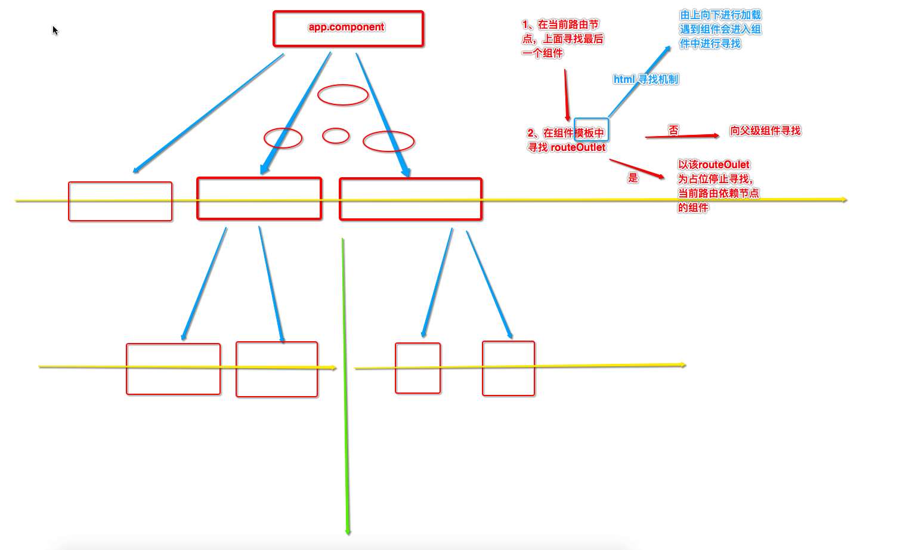

## Angular

主讲：陈华旺

### 十八、DI

+ Dependency Injection  依赖注入
+ 在一个类被创建为对象时，不关心 构造中传入的参数到底如何被创建对象，只关心当前类创建时该对象的传入
+ DI 的使用
  + 1、定义一个普通的类
  + 2、在 `app.model.ts` 文件中，将该类定义为注入提供者
  + 3、在需要组件的构造函数中，定义该类的对象名称，完成依赖注入

**app.model.ts**

```typescript
import { BrowserModule } from '@angular/platform-browser';
import { NgModule } from '@angular/core';
import { FormsModule, ReactiveFormsModule } from '@angular/forms'

import { AppRoutingModule } from './app-routing.module';
import { AppComponent } from './app.component';

import { DiComponentComponent } from './componets/dayFive/DI-components/di-component/di-component.component'
import { DataService } from './componets/dayFive/DI-components/dataService';
import { DiComponentChildComponent } from './componets/dayFive/DI-components/di-component-child/di-component-child.component';


@NgModule({
  declarations: [
    AppComponent,
    DiComponentComponent,
    DiComponentChildComponent
    
  ],
  imports: [
    BrowserModule,
    AppRoutingModule,
    // 模板表单
    FormsModule,
    ReactiveFormsModule
  ],
  // 提供者 用于为当前项目中所有需要注入参数的 组件 提供 对象的 指定
  providers: [
    DataService
  ],
  // bootstrap: [AppComponent,NewoneComponent]
  bootstrap: [AppComponent]
})
export class AppModule { }
```

**其它组件**

```typescript
import { Component, OnInit } from '@angular/core';
import { DataService } from '../dataService';

@Component({
  selector: 'app-di-component',
  templateUrl: './di-component.component.html',
  styleUrls: ['./di-component.component.css']
})
export class DiComponentComponent implements OnInit {

  // private ds = new DataService();

  //被注入的组件会作为，该组件的属性存在
  constructor(private ds:DataService) { }

  ngOnInit() {
  }
}
```

+ angular 中注入的特性
  + 1、被作为注入类的类（提供者），只会被创建一次
  + 2、被创建的注入类可以为多个组件提供服务
  + 3、因为对象只有一个，可以使用依赖注入完成 组件间 数据传递（中央数据总线）
  + 4、注入的 搜索方式
+ 主要目的 ，做解耦合 ，和MVC 的 Service 分离


### 十九、HTTP服务

+ 远端数据获取，angular 项目 只能是用  异步请求（AJAX）方式获取远端数据

#### 19.1、导入 HTTP 模块

+ 在app.module.ts文件中加载模块

```typescript
import { BrowserModule } from '@angular/platform-browser';
import { NgModule } from '@angular/core';
import { FormsModule, ReactiveFormsModule } from '@angular/forms'
import { HttpModule,JsonpModule } from '@angular/http';

import { AppRoutingModule } from './app-routing.module';
import { AppComponent } from './app.component';

import { HttpAjaxComponent } from './componets/dayFive/http-components/http-ajax/http-ajax.component';

@NgModule({
  declarations: [
    AppComponent,
    HttpAjaxComponent
  ],
  imports: [
    BrowserModule,
    AppRoutingModule,
    // 模板表单
    FormsModule,
    ReactiveFormsModule,
    // 同服务器的正常请求
    HttpModule,
    // 跨服务的跨域请求
    JsonpModule
  ],
  // 提供者 用于为当前项目中所有需要注入参数的 组件 提供 对象的 指定
  // 自定义的 对象 提供
  providers: [
    DataService
  ],
  // bootstrap: [AppComponent,NewoneComponent]
  bootstrap: [AppComponent]
})
export class AppModule { }

```

#### 19.2、配置代理服务

+ 在项目跟目录下创建一个 `proxy.cfg.json` 文件

```json
{
    "/api":{
        "target":"http://127.0.0.1:80"
    }
}
```

+ 启动服务时 以 代理模式启动

```po
ng server --proxy-config proxy.cfg.json
```

+ 或者在package.json 文件中 进行 定义启动项

```json
"scripts": {
    "ng": "ng",
    "start": "ng server --proxy-config proxy.cfg.json",
    "build": "ng build",
    "test": "ng test",
    "lint": "ng lint",
    "e2e": "ng e2e"
  }
```

```powershell
npm start
```

#### 19.3、Http.get() 方法使用

**数据获取**

```typescript
import { Component, OnInit } from '@angular/core';
import { Http ,URLSearchParams ,Jsonp } from '@angular/http';
import { FormGroup, FormControl } from '@angular/forms';

@Component({
  selector: 'app-http-ajax',
  templateUrl: './http-ajax.component.html',
  styleUrls: ['./http-ajax.component.css']
})
export class HttpAjaxComponent implements OnInit {

  private user = {};
  
  constructor(
    private http:Http,
    private jsonp:Jsonp
  ) { }

  ngOnInit() {
  }

  // 单纯数据获取
  private getData(){
    // let response = this.http.get("http://127.0.0.1:80/angularData.php");
    let response = this.http.get("/api/angularData.php");    
    //  0 1 2 3 4

    // 订阅
    //    当前请求 完全结束 并且获取数据后 进行数据处理
    response.subscribe((data)=>{
      // 对数据进行解析
      //  data ==> Response
      //      存在一个方法  json() 获取AJAX请求的返回数据
      // console.log(data.json());
      this.user = data.json()
    });
  }
}

```

**传递数据**

```typescript
import { Component, OnInit } from '@angular/core';
import { Http ,URLSearchParams ,Jsonp } from '@angular/http';
import { FormGroup, FormControl } from '@angular/forms';

@Component({
  selector: 'app-http-ajax',
  templateUrl: './http-ajax.component.html',
  styleUrls: ['./http-ajax.component.css']
})
export class HttpAjaxComponent implements OnInit {
  
  private userForm = new FormGroup({
    name:new FormControl("",[]),
    age:new FormControl("",[])
  })

  constructor(
    private http:Http,
    private jsonp:Jsonp
  ) { }

  ngOnInit() {
  }

  private sendData(){
    let url = "/api/angularSendData.php";
    /*
      {
        url?: string|null
        method?: string|RequestMethod|null
        search?: string|URLSearchParams|{[key: string]: any | any[]}|null
        params?: string|URLSearchParams|{[key: string]: any | any[]}|null
        headers?: Headers|null
        body?: any
        withCredentials?: boolean|null
        responseType?: ResponseContentType|null
      } 
      
      {
        key:value,
        key:value
      }

     */
    // URLSearchParams  需要导包，但是 VSCode 不提示导包
    // let prams = new URLSearchParams();
    // prams.append("name",this.name);
    // prams.append("age",this.age);

    // this.http.get(url,{
    //   // params:prams
    //   search:prams
    // }).subscribe((data)=>{
    //   console.log(data);
    // })

    console.log(this.userForm.value);

    this.http.get(url,{
      // params:prams
      // search:{
      //   name:this.name,
      //   age:this.age
      // }
      search:this.userForm.value
    }).subscribe((data)=>{
      console.log(data);
    })
  }
}
```

#### 19.4、Http.post() 方法使用

```typescript
import { Component, OnInit } from '@angular/core';
import { Http ,URLSearchParams ,Jsonp } from '@angular/http';
import { FormGroup, FormControl } from '@angular/forms';

@Component({
  selector: 'app-http-ajax',
  templateUrl: './http-ajax.component.html',
  styleUrls: ['./http-ajax.component.css']
})
export class HttpAjaxComponent implements OnInit {

  private userForm = new FormGroup({
    name:new FormControl("",[]),
    age:new FormControl("",[])
  })

  constructor(
    private http:Http,
    private jsonp:Jsonp
  ) { }

  ngOnInit() {
  }

  private sendDataPost(){
    let url = "/api/angularSendData.php";
    // this.http.post(url,body,optionArgs)
    // body 是请求需要传递的数据
    // URLSearchParams  用在POST 请求中  FromsData 类型的数据传递
    let params = new URLSearchParams();
    params.append("name",this.userForm.value.name);
    params.append("age",this.userForm.value.age);
    this.http.post(url,params)
        .subscribe((data)=>{
          console.log(data.json());
        });
  }
}
```

#### 19.5、Jsonp.jsonp() 方法使用

```typescript
import { Component, OnInit } from '@angular/core';
import { Http ,URLSearchParams ,Jsonp } from '@angular/http';
import { FormGroup, FormControl } from '@angular/forms';

@Component({
  selector: 'app-http-ajax',
  templateUrl: './http-ajax.component.html',
  styleUrls: ['./http-ajax.component.css']
})
export class HttpAjaxComponent implements OnInit {

  private wk:string="";

  constructor(
    private http:Http,
    private jsonp:Jsonp
  ) { }

  ngOnInit() {
  }
  
  private seachData(){
    // 跨域请求
    let url = "https://sp0.baidu.com/5a1Fazu8AA54nxGko9WTAnF6hhy/su";
    // let params = new URLSearchParams();
    // params.append("wd",this.wk);
    // params.append("age",this.userForm.value.age);
    // JSONP 方法 只能使用 get请求
    // this.jsonp.post(url,params)
    //     .subscribe((data)=>{
    //       console.log(data.json);
    //     });

    this.jsonp.get(url,{
      params:{
        "wd":this.wk,
        // JSONP_CALLBACK 关键占位符，以字符的方式定位在请求中
        //   格式 大小写 都不能变
        "cb":"JSONP_CALLBACK"
        // key 是服务器所需要的回调名 
        // value "JSONP_CALLBACK"
      }
    }).subscribe((data)=>{
      console.log(data.json());
    });
  }
}
```

### 二十、路由

+ 一个Angular 项目，可能是由多个组件组成，在一些页面中，不分内容 可能会根据用户的行为发生变化，怎么去切换页面的内容
+ MVVM  SPA   如何通过用户行为 却确定 显示的页面（DOM的替换和渲染）==>  Component
+ Angular 的路由机制，动态修改页面中DOM元素，使得 然用户看起页面发生了更改，其实只是使用了一个组件替代了当前显示组件的位置

#### 20.1 几个概念

| 类名            | 标签名               | 指令名        | 作用                                       |
| ------------- | ----------------- | ---------- | ---------------------------------------- |
| Routes        | -                 | -          | 配置路由选项，通过保存URL和组件的关系，以完成在哪个    *地方*    显示 |
| Router        | -                 | -          | 运行过程中执行的路由对象，TS代码中对于路由的控制                |
| ActivateRoute | -                 | -          | 当前激活的路由对象（当前路由的地址，传递参数……）                |
| RouterLink    | -                 | routerLink | 是在HTML页面中声明路由的导航，创建一个具有 a 标签跳转功能的元素      |
| RouterOutlet  | \<router-outlet\> | -          | 路由出口，是在HTML 页面中定义一个 组件占位符，为将要显示的组件提供填写位置 |

#### 20.2 路由的基本用法

##### 1、创建 app-routing-module.ts 文件

```typescript
import { NgModule } from '@angular/core'
import { Routes , RouterModule } from '@angular/router'

// Routes 的使用 ，路由的映射定义
const routes:Routes = [];

//完成 Angular 的模块定义 
@NgModule({
    imports:[RouterModule.forRoot(routes)]
    exports:[RouterModule]
})
export class AppRoutingModule{ }
```

##### 2、加载并导入模块

**app.module.ts**

```typescript
imports :[
    AppRoutingModule   // 名字可以随便写，是一个自定义模块类
]
```

> 当在创建项目时  指定了  —routing  参数，上述两步不需要在手动编写

```powershell
ng new 项目名 --routing
```

##### 3、路由的映射配置

+ 定义 URL 和组件的关系 已经 组件路由和组件路由的关系（子路由）

```typescript
// Routes = [{},{},{}……]
//   其中的每一个对象 都是 一个 URL 和组件的映射
const routes:Routes = [
  //{path:"",component:"",chilren:[]}
  //    path 定义URL地址
  //    component 用于指定映射组件
  //    chilren 定义子路由  取值类型 为 []
];
```

##### 4、在模板中使用

+ RouterOutlet  在一个组件中  有且仅有一个  name='primary'  `<router-outlet>`

```html
<div class="container">

  <div class="col-lg-2 col-lg-offset-1">
      <ul>
        <li>
          <a routerLink="/regist" >注册</a>
        </li>
        <li>
          <a routerLink="/login" >登录</a>
        </li>
        <li>
          <a routerLink="/about" >关于我们</a>
        </li>
      </ul>
  </div>
  <div class="col-lg-8">
    <router-outlet></router-outlet>
  </div>
</div>
```

##### 5、子路由的定义

```typescript
{
    path:'parent',
    component:ParentRouterComponent
    ,children:[
      {path:'',component:ParentRouterComponent},
      // /parent/child
      // 会使用组件模板替换parent组件模板中的router-outlet
      {path:'child',component:ChildComponent}
    ]
  }, 
```

```html
<h3>
  <a routerLink="./">当前</a>
</h3>

<h3>
  <!-- 相对路径  相对于浏览器地址栏的路径 -->
  <a routerLink="child">子路由-child</a>
  <a routerLink="./child">子路由-./child</a>
  <!-- 绝对路径  相对于项目根路径的路径   localhost:4200 -->
  <a routerLink="/child">子路由-/child</a>
</h3>
<hr>
<router-outlet></router-outlet>
```

##### 6、路由的搜索



##### 7、重定向路由

+ 用户访问一个url，在项目可以不为该url指定组件，指向另外一个url 

```typescript
当发送某个url，该url不指向 任何组件，指向另一个url

     // 在url中一部分出现** ， 不代表通配符
      {path:'regist/**',component:RegistComponent},
      // redirectTo:重定向到
      // /loginPage/log  ==> prefix ===> 匹配前缀 ===> 使用redirectTo的值替换前缀 ===> aaa/log
      // /loginPage/log  ==> full ===> 完全匹配 ===> 'loginPage/log' ==> LoginComponent
      //  注意：   1、路由的匹配策略pathMatch prefix代表匹配前缀（默认值）,full 完全匹配
      //          2、'' 是所有的url的前缀
      //              ====> 所有的url都匹配'' 
      //              ====> "" 如果使用重定向路由，一定要提供pathMatch  并且值要是 full
      {path:'loginPage',redirectTo:"aaa",pathMatch:"prefix"},
```

##### 8、路由的参数传递

###### 8-1 传统get方式传参

MainComponent

```html
<input type="text" [(ngModel)]="username" >
<!-- /about?name=abc -->
<a [routerLink]="'/about'" [queryParams]="{name:username}">传统get方式--到关于我们</a>
```

AboutComponent

```typescript
  registUser:string;
  constructor(
    private activitedRoute:ActivatedRoute
  ) { 
    this.registUser = this.activitedRoute.snapshot.queryParams["name"];
  }
```

```html
<p>注册的用户的用户名是：{{registUser}}</p>
```

###### 8-2 rest风格参数

| get               | rest           |
| ----------------- | -------------- |
| /user/delete?id=1 | /user/delete/1 |

请求参数作为url的一部分

组件模板

```html
<input type="text" [(ngModel)]="username" >

<!-- /about?name=abc -->
<hr>
<a [routerLink]="'/about'" [queryParams]="{name:username}">传统get方式--到关于我们</a>

<hr>
<a [routerLink]="'/about/zhangsan'">REST风格传递参数-y1-1</a>
<a [routerLink]="'/about/username'">REST风格传递参数-y1-2</a>
<a [routerLink]="'/about/' + username">REST风格传递参数-y1-2</a>
<hr>
<a [routerLink]="['/about','zhangsan']">REST风格传递参数-y2-1</a>
<a [routerLink]="['/about',username]">REST风格传递参数-y2-2</a>
```

路由目标页

```typescript
  otherName:string;
  constructor(
    private activitedRoute:ActivatedRoute
  ) { 
    this.otherName = this.activitedRoute.snapshot.params["someName"];
  }
```

路由配置

```typescript
  {path:'about/:someName',component:AboutusComponent},
```

##### 9、辅助路由（多路由）

带有name属性的router-outlet

> ​	一个页面上可以有且仅有一个 主路由 primary 
>
> ​	但是可以有多个辅助路由

```html
 <div class="col-lg-8">
    <router-outlet></router-outlet>
  </div>
 

  <div class="ccc fixBottom">
    <router-outlet name="otherOutlet"></router-outlet>
  </div>
```

```typescript
{path:"loginWithOther",component:LoginComponent,outlet:'otherOutlet'},
```

```html
   <li>
            <a [routerLink]="[{outlets: { primary:'regist',otherOutlet:'loginWithOther' } }]">显示登录到辅助路由</a>
        </li>
        <li>
            <a [routerLink]="[{outlets: { otherOutlet:null } }]">隐藏辅助路由</a>
        </li>

  <div class="col-lg-8">
    <router-outlet></router-outlet>
  </div>
 

  <div class="ccc fixBottom">
    <router-outlet name="otherOutlet"></router-outlet>
  </div>
```

##### 10、路由守卫

控制是否能够 激活 或者 离开 某个路由

是一些钩子（在特定场景下执行的特定方法，一般情况下，钩子函数不需要程序员自己调用）

| 名称            | 作用                  |
| ------------- | ------------------- |
| canActivate   | 决定是否激活（进入）某个路由      |
| canDeactivate | 决定是否可以离开某个路由        |
| resolve       | 在进入某个路由前的守卫，用于初始化数据 |

1、定义ts类

类中方法的方法名、参数、返回值

@Injectable装饰器

```typescript
import { CanActivate, CanDeactivate, Resolve, ActivatedRouteSnapshot, RouterStateSnapshot } from "@angular/router";
import { EditComponent } from "./edit/edit.component";
import { Injectable } from '@angular/core';

@Injectable()
export class Gard implements CanActivate,CanDeactivate<EditComponent>,Resolve<string>{
    
    resolve(route: ActivatedRouteSnapshot, state: RouterStateSnapshot){
        // 进入路有前执行，用于初始化数据
        console.log("准备进入eidt")
        return null;
    }
    canDeactivate(component: EditComponent, currentRoute: ActivatedRouteSnapshot, currentState: RouterStateSnapshot, nextState?: RouterStateSnapshot) {
        // 返回boolean类型  true 能离开 路由
        if(component.username != "aaa")
        {
            return window.confirm("您输入的内容不是aaa，确认要离开吗？");
        }
    }
    canActivate(route: ActivatedRouteSnapshot, state: RouterStateSnapshot){
        // 返回boolean类型  true 能进入/激活 路由
        let name = route.queryParams["username"];
        return name == "admin";
    }

}
```

2、配置DI(app.module.ts)

```typescript
  providers: [
    Gard
  ],
```

3、在路由中配置守卫

```typescript
  {path:"edit",component:EditComponent,
    canActivate:[Gard],
    canDeactivate:[Gard],
    resolve:{
      result:Gard
    }
  },
```

##### 11、404的处理

```typescript
 //在路由的最后位置，可以配置带有通配符的映射关系
  //路由的匹配规则是从上到下（从数组的第一个元素开始），依次匹配 ，直到找到第一个匹配的路由
  {path:'**',component:NotfoundComponent}
```

##### 12、在ts中事件路由的跳转

```typescript
constructor(
    private router:Router
  ) { }


  toDir()
  {
    // 参数是一个[]，数组中包含路径,和 routerLink的值一致
    this.router.navigate(['/dir']);
  }
```

```html
<button (click)="toDir()">到指令</button>
```


### 二十一、项目打包和发布

#### 1、打包

```powershell
ng build
ng build --base-href=/项目名/
```

输出目录：项目/dist

> 注意：配置一个provider

```typescript
 // 浏览器的定位策略
 {provide:LocationStrategy,useClass:HashLocationStrategy}
```


#### 2、发布

将打包生成的代码按照特定的web服务器规范放到特定位置


> 注意: index.html 中的 <base href="/"> ！！！！


